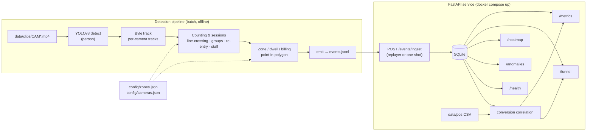
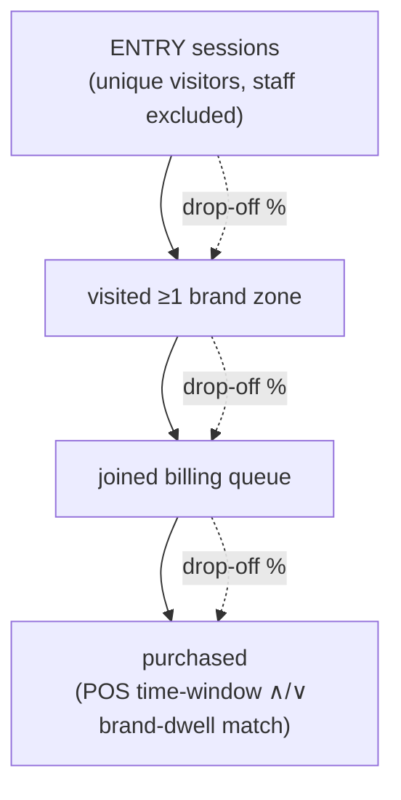

# feat: Store Intelligence end-to-end pipeline

## Summary

Build a containerized, end-to-end Store Intelligence system for **one store (Brigade Road, Bangalore; 5 cameras)** within a 48-hour window. A batch CV pipeline (YOLOv8 + ByteTrack) turns raw CCTV into a self-defined structured event stream; a FastAPI service ingests those events and serves real-time analytics (metrics, funnel, heatmap, anomalies, health) including POS-correlated conversion. Ships via `docker compose up` with structured logging, tests, `DESIGN.md`, and `CHOICES.md`.

Grading is a **manual ~10-minute review by two humans** (per `data/Assessment Evaluation Frameworkb24a398.pdf`): run the system, inspect events, validate `/metrics` + `/funnel`, read the docs, score out of 100 (Detection 30 + API 35 + Production 20 + Thinking 15). **Outputs must visibly vary with input — hardcoding caps the score at 50.** Strategy: gate-first (always submittable), then correctness-first on the heaviest-weighted parts. See `STRATEGY.md`.

---

## Problem frame

Apex/Purplle physical stores are an analytics blind spot. The deliverable converts raw, messy CCTV (group entries, staff movement, re-entry, occlusion, queue buildup, empty periods, overlapping camera fields) into trustworthy, queryable store analytics — without the de-dup and staff-counting errors that inflate vendor numbers. The unit of truth is the **visitor session**, and the north-star business metric is **offline conversion rate** (purchasing visitors ÷ unique visitors).

**Reality reconciled from the dataset (differs from the idealized brief):**
- Input is **one store, 5 cameras** (`data/clips/CAM 1.mp4` … `CAM 5.mp4`), not 5 stores × 3 angles.
- Store layout is a **floor-plan image** (`data/_layout_extracted.png`), not `store_layout.json`. Entry = bottom-left door; billing = right-side cash counter; ~16 named brand bays + makeup/nail units are the zones.
- POS is a **rich real Purplle sales CSV** (`order_time`, `store_id`, `brand_name`, `sub_category`, `salesperson`, `GMV`/`NMV`), enabling brand-bay-dwell → brand-purchase conversion.
- **No `sample_events.jsonl`, no `assertions.py`** — we define and document the event schema ourselves; there is no automated test harness to pass.

---

## Requirements

Traceability IDs referenced by implementation units below. Sourced from the brief's spec tables and the PDF rubric.

**Acceptance gate (mandatory — fail any = rejected before scoring):**
- **R1** — `docker compose up` runs the API with no manual steps beyond `git clone`; system does not crash on basic use.
- **R2** — `GET /stores/{id}/metrics` returns valid JSON; pipeline produces structured events; `DESIGN.md` + `CHOICES.md` exist and are non-trivial.

**Detection (30):**
- **R3** — Entry/exit counts approximately match a manual count on a sample clip.
- **R4** — Staff flagged `is_staff=true` and excluded from customer metrics.
- **R5** — Re-entry of the same physical person emits `REENTRY`, not a second `ENTRY`.
- **R6** — A group of N entering together yields N `ENTRY` events, not 1.
- **R7** — Low-confidence detections are flagged, never silently dropped or falsely elevated.
- **R8** — All events validate against the schema; `event_id`s unique; timestamps correct (ISO-8601 UTC derived from clip + frame offset).
- **R9** — Same physical person in the floor↔entry camera overlap is not double-counted.

**API (35):**
- **R10** — `POST /events/ingest`: accepts batches ≤500, validates, **idempotent by `event_id`**, partial success on malformed events, structured error response.
- **R11** — `GET /stores/{id}/metrics`: unique visitors, conversion rate, avg dwell per zone, queue depth, abandonment rate; excludes staff; handles zero-purchase/zero-traffic without crashing or returning null; computed live.
- **R12** — `GET /stores/{id}/funnel`: Entry → Zone Visit → Billing Queue → Purchase with counts + drop-off %; **session is the unit; re-entries not double-counted**.
- **R13** — `GET /stores/{id}/heatmap`: zone visit frequency + avg dwell, normalized 0–100; `data_confidence` flag when <20 sessions in window.
- **R14** — `GET /stores/{id}/anomalies`: queue spike, conversion drop vs baseline, dead zone (no visits 30 min); severity `INFO`/`WARN`/`CRITICAL`; `suggested_action` per anomaly.
- **R15** — `GET /health`: status, last event timestamp per store, `STALE_FEED` warning if >10 min lag.
- **R16** — Conversion correlates visitor sessions to POS by **time window** (billing-zone presence in the 5-min window before a transaction) **and** by **brand-bay dwell → matching brand purchase** (differentiator).

**Production (20):**
- **R17** — Structured logging per request: `trace_id`, `store_id`, `endpoint`, `latency_ms`, `event_count` (ingest), `status_code`.
- **R18** — Graceful degradation: storage unavailable → HTTP 503 structured body; no raw stack traces in responses.
- **R19** — Tests cover key + edge scenarios (empty store, all-staff, zero purchases, re-entry in funnel); meaningful coverage.
- **R20** — README: complete setup in ≤5 commands; explains running the pipeline against clips and feeding output to the API.

**Thinking (15) & integrity:**
- **R21** — `DESIGN.md`: plain-language architecture + an **"AI-Assisted Decisions"** section (2–3 places an LLM shaped design, agreed/overrode).
- **R22** — `CHOICES.md`: three decisions (detection model, event-schema rationale, one API architecture choice) with options considered / trade-offs / what was chosen and why.
- **R23** — Prompt blocks at the top of each test file (`# PROMPT:` / `# CHANGES MADE:`).
- **R24** — **Integrity:** every endpoint's output varies with input; no hardcoded/precomputed answers (violation caps score at 50).

---

## Key technical decisions

- **KTD-1 — Detector: YOLOv8 (`yolov8s`, person class), off-the-shelf, no training.** Proven, fast on 1080p@15fps, strong community support; the license forbids training on the footage anyway. Reviewer expects defensible reasoning over novelty. (R3, R7)
- **KTD-2 — Tracker: ByteTrack.** Keeps low-confidence boxes associated through occlusion (supports R7 "degrade gracefully"), pairs natively with YOLOv8, gives one stable track ID per person → individual counts for groups (R6).
- **KTD-3 — Direction: virtual line-crossing on the entry camera.** Deterministic and explainable: a track whose centroid crosses the configured entry line inbound = `ENTRY`, outbound = `EXIT`. Entry camera is the **single source of truth** for entry/exit counts; other cameras never emit ENTRY/EXIT → resolves overlap double-counting (R9).
- **KTD-4 — Re-entry de-dup: appearance embedding + trajectory, short time window.** Faces are blurred, so Re-ID leans on a lightweight clothing/body appearance signature + spatial-temporal gating. A person re-crossing inbound within N minutes whose signature matches a recently-exited visitor → `REENTRY` reusing the prior `visitor_id` (R5). Window is configurable; the known failure mode (different person, similar appearance, same door, seconds apart) is documented in `CHOICES.md`.
- **KTD-5 — Staff exclusion: heuristic, flagged not deleted.** Combine (a) uniform-color signature sampled from a calibrated crop and (b) behavioral signal (persistent multi-zone movement, long cumulative presence, repeated billing-side dwell). Sets `is_staff=true`; events are emitted (never dropped) and excluded at query time. Explicitly framed as a heuristic with limits — exactly the honest trade-off the rubric rewards. (R4)
- **KTD-6 — Zones: rule-based polygons calibrated from the floor-plan.** Point-in-polygon on each track's foot position against zone polygons defined in a committed `config/zones.json`. No VLM cost; VLM-for-zone-classification is documented as considered-and-rejected in `CHOICES.md`. (R12, R13, R16)
- **KTD-7 — Timing: batch-process clips → events JSONL → replay into the API.** The brief permits batch + replay. Reproducible, de-risks the 48h clock, and gives a clean event stream. "Real-time" is satisfied by timestamped replay (and powers a live dashboard if built). (R8, R11)
- **KTD-8 — Storage: SQLite.** Zero extra container, clean `docker compose up`, ample for one store; idempotency via `event_id` primary key / upsert. Postgres rejected (adds a service + startup risk against the gate) — documented in `CHOICES.md`. (R1, R10)
- **KTD-9 — API framework: FastAPI + Pydantic.** Schema validation, automatic OpenAPI docs (helps the reviewer's 3-min API check), async-friendly. Pydantic models are the single shared schema definition across pipeline and API. (R8, R10)
- **KTD-10 — Conversion: dual method.** Baseline = billing-zone presence within 5 min before a POS `order_time` (per brief). Differentiator = brand-bay dwell matched to the purchased `brand_name`/`sub_category` on the correlated transaction. Both surfaced; brand method is the tie-breaker "understanding of the business metric." (R16)
- **KTD-11 — Event schema (self-defined, adopt the brief's shape).** One record per behavioral event; see High-Level Technical Design. Shared Pydantic model enforces it at emit and ingest time. (R8)

---

## High-Level Technical Design

### Architecture & data flow



### Event schema (self-defined)

```jsonc
{
  "event_id": "uuid-v4",            // globally unique (ingest idempotency key)
  "store_id": "ST1008",             // Brigade Road
  "camera_id": "CAM_ENTRY",         // logical role, mapped from CAM 1..5
  "visitor_id": "VIS_xxxxxx",       // per-visit session token; reused on REENTRY
  "event_type": "ENTRY|EXIT|ZONE_ENTER|ZONE_EXIT|ZONE_DWELL|BILLING_QUEUE_JOIN|BILLING_QUEUE_ABANDON|REENTRY",
  "timestamp": "ISO-8601 UTC",      // clip start + frame offset / fps
  "zone_id": "DERMDOC|...|null",    // null for ENTRY/EXIT
  "dwell_ms": 8400,                 // 0 for instantaneous events
  "is_staff": false,
  "confidence": 0.91,               // real detection confidence; never suppressed
  "metadata": { "queue_depth": 3, "sku_zone": "...", "session_seq": 5 }
}
```

### Conversion funnel (session as the unit)



---

## Output Structure

```
store-intelligence/
├── pipeline/
│   ├── detect.py          # YOLOv8 + ByteTrack per-camera detection→tracks
│   ├── counting.py        # line-crossing, direction, group counts, sessions
│   ├── reid.py            # appearance+trajectory re-entry de-dup
│   ├── staff.py           # staff heuristic (uniform + behavior)
│   ├── zones.py           # point-in-polygon zone/dwell/billing events
│   ├── emit.py            # event construction + JSONL writer
│   ├── calibrate.py       # frame extraction + camera→role mapping helper
│   └── run.py             # orchestrate all clips → events.jsonl
├── app/
│   ├── main.py            # FastAPI app + middleware (logging, error handling)
│   ├── schema.py          # shared Pydantic event + response models
│   ├── db.py              # SQLite connection, migrations, upsert
│   ├── ingestion.py       # batch ingest, dedup, partial success
│   ├── metrics.py         # metrics computation
│   ├── funnel.py          # session-based funnel
│   ├── heatmap.py         # zone heatmap
│   ├── anomalies.py       # anomaly detection
│   ├── conversion.py      # POS correlation (time-window + brand-dwell)
│   └── health.py          # health + stale-feed
├── config/
│   ├── cameras.json       # CAM 1..5 → logical role + entry line coords
│   └── zones.json         # zone_id → polygon (image coords) per camera
├── tests/
│   ├── test_pipeline.py
│   ├── test_ingestion.py
│   ├── test_metrics.py
│   ├── test_funnel.py
│   ├── test_anomalies.py
│   └── test_conversion.py
├── docs/
│   ├── DESIGN.md
│   └── CHOICES.md
├── replay.py              # stream events.jsonl → POST /events/ingest (live feel)
├── Dockerfile
├── docker-compose.yml
├── requirements.txt
├── README.md
└── STRATEGY.md
```

The per-unit **Files** lists remain authoritative; the implementer may adjust layout if a better shape emerges.

---

## Implementation units

Grouped into four phases. Build phases in order; within Phase 1–2, the API can be built against synthetic events in parallel with detection if needed.

### Phase 0 — Foundation & gate

### U1. Project scaffolding, dependencies, Docker skeleton

**Goal:** Repo skeleton + reproducible environment + a bootable API that satisfies the acceptance gate from day one (even before real events exist).
**Requirements:** R1, R2 (partial), R20.
**Dependencies:** none.
**Files:** `requirements.txt`, `Dockerfile`, `docker-compose.yml`, `app/main.py`, `app/db.py`, `app/schema.py` (stubs), `README.md` (skeleton), `pipeline/run.py` (stub).
**Approach:** Pin Python 3.11, `ultralytics`, `opencv-python-headless`, `fastapi`, `uvicorn`, `pydantic`, `pandas`, `pytest`. Dockerfile installs system `ffmpeg` + `libgl` for OpenCV. `docker-compose.yml` defines an always-on `api` service and a one-shot `pipeline` service (`docker compose run pipeline`) sharing a volume for `events/` and `data/`. API boots with an empty SQLite DB and a working `/metrics` returning a valid zero-state response. This unit alone should pass the acceptance gate.
**Patterns to follow:** suggested repo structure in the brief; standard FastAPI app-factory layout.
**Test scenarios:**
- Happy: `GET /metrics` on empty DB returns 200 with zeroed, well-typed fields (not null, no crash). *(Covers R2, R11 zero-state)*
- Edge: app starts with no `events.jsonl` present and no `data/` mounted → still boots, `/health` returns 200.
- Verification: `docker compose up` on a clean checkout serves `/metrics` and `/health`; `docker compose run pipeline --help` works.

### U2. Camera mapping & zone/line calibration

**Goal:** Determine which `CAM n` is entry/floor/billing and capture entry-line + zone polygons into committed config.
**Requirements:** R3, R8, R9, R12, R13.
**Dependencies:** U1.
**Files:** `pipeline/calibrate.py`, `config/cameras.json`, `config/zones.json`.
**Approach:** `calibrate.py` extracts representative frames from each clip (ffmpeg/OpenCV) into a gitignored scratch dir. Manually (with frame inspection) assign each `CAM n` a logical role (`CAM_ENTRY`, `CAM_FLOOR_*`, `CAM_BILLING`) and record the entry-threshold line segment (image coords) + per-camera zone polygons traced against `data/_layout_extracted.png` and the frames. Note observed clip differences (CAM 4/5 are ~73 MB vs 160–190 MB — likely shorter or different coverage). Config is committed (it contains no licensed imagery, only coordinates + role labels).
**Patterns to follow:** zone names taken verbatim from the floor-plan (DermDoc, Minimalist, Lakme, Maybelline, Faces Canada, Colorbar+Sugar, Swiss Beauty, Renee/NY Bae, Alps Goodness, Streax, Good Vibes, Aqualogica, The Face Shop, EB Korean, Accessories, Nail Unit, Makeup Unit, PMU, F.O.H, Cash Counter).
**Test scenarios:**
- Happy: `config/zones.json` and `config/cameras.json` load and validate against a Pydantic config model; every polygon has ≥3 points; entry line has 2 points.
- Edge: a camera with no zones (pure entry view) loads with an empty zone list, not an error.
- Verification: a debug overlay renders zones + entry line on a sample frame and visually matches the floor-plan. *(human eyeball)*
- *Execution note:* this unit is partly manual (visual calibration); keep the coordinates in config, not code.

### U3. Shared event schema

**Goal:** Single Pydantic definition of the event record + enums, imported by both pipeline and API.
**Requirements:** R8.
**Dependencies:** U1.
**Files:** `app/schema.py`, `tests/test_pipeline.py` (schema validation cases).
**Approach:** Define `Event` model, `EventType` enum, and `metadata` sub-model matching the High-Level Technical Design. Provide a `validate`/`from_dict` path used by `emit.py` (fail fast on bad events at emit time) and by ingest. Generate `event_id` as uuid4; enforce ISO-8601 UTC timestamps; `zone_id` nullable only for ENTRY/EXIT/REENTRY.
**Test scenarios:**
- Happy: a fully-populated event validates; round-trips dict→model→dict unchanged. *(Covers R8)*
- Edge: ENTRY with non-null `zone_id` → validation error; ZONE_DWELL with `dwell_ms=0` flagged invalid.
- Error: missing `event_id`/`timestamp` → validation error with field name.
- Edge: duplicate `event_id` detection is the ingest layer's job (U7), not the schema's — assert schema permits but ingest dedups.

---

### Phase 1 — Detection pipeline

### U4. Detection + tracking core

**Goal:** Per-camera YOLOv8 person detection feeding ByteTrack to produce stable per-camera tracks with confidence.
**Requirements:** R3, R6, R7.
**Dependencies:** U1, U2.
**Files:** `pipeline/detect.py`, `tests/test_pipeline.py`.
**Approach:** Load `yolov8s`, run inference per frame at the source 15 fps (allow frame-skip config for speed), filter to person class, hand boxes + scores to ByteTrack. Emit per-frame `(track_id, bbox, confidence, frame_idx, camera_id)`. Carry the real confidence through; never threshold-drop silently — instead tag low-confidence tracks. Foot position = bbox bottom-center (used for zones).
**Patterns to follow:** `ultralytics` + `bytetrack` standard integration; deterministic seeding for reproducibility (R24 — output varies with input but is stable per input).
**Test scenarios:**
- Happy: on a short fixture clip, returns ≥1 track spanning multiple frames with stable `track_id`. *(Covers R3)*
- Edge: empty/quiet segment yields zero tracks without error (R11 zero-traffic upstream).
- Edge: low-confidence detections appear in output flagged, not dropped. *(Covers R7)*
- Integration: two people crossing yield two distinct persistent track IDs. *(Covers R6)*

### U5. Counting, direction & visitor sessions

**Goal:** Convert entry-camera track trajectories into ENTRY/EXIT events with per-visit `visitor_id` session tokens; count groups as individuals.
**Requirements:** R3, R6, R8, R9.
**Dependencies:** U3, U4.
**Files:** `pipeline/counting.py`, `tests/test_pipeline.py`.
**Approach:** For the entry camera, detect when a track centroid crosses the configured entry line; sign of crossing → ENTRY (inbound) or EXIT (outbound). Each new inbound track opens a session (`visitor_id`, `session_seq=0`). Group entry handled naturally: N tracks crossing = N ENTRY events. Non-entry cameras never emit ENTRY/EXIT (R9). Maintain a session registry keyed by `(camera, track_id)` mapped to `visitor_id`.
**Test scenarios:**
- Happy: a single inbound crossing emits exactly one ENTRY with a fresh `visitor_id`. *(Covers R3)*
- Happy: outbound crossing emits EXIT closing the session.
- Edge: a track that loiters on the line without fully crossing emits nothing (hysteresis/anti-flicker).
- Integration: 3 tracks crossing inbound within 2 s emit 3 ENTRY events. *(Covers R6)*
- Edge: a person appearing on a floor camera (no entry line) produces zone events but no ENTRY. *(Covers R9)*

### U6. Re-entry de-dup & staff exclusion

**Goal:** Recognize returning visitors (REENTRY, not new ENTRY) and flag staff, both honestly bounded.
**Requirements:** R4, R5, R7.
**Dependencies:** U5.
**Files:** `pipeline/reid.py`, `pipeline/staff.py`, `tests/test_pipeline.py`.
**Approach:** **Re-ID** — on each inbound crossing, compute a lightweight appearance signature (color histogram / small embedding over the torso crop) + time-gate; if it matches a recently-exited visitor within window N, reuse that `visitor_id` and emit REENTRY instead of ENTRY (R5). **Staff** — score each visitor on uniform-color match (sampled crop) + behavioral signal (multi-zone persistence, long cumulative dwell, repeated cash-counter-side presence); above threshold → `is_staff=true` on that visitor's events (emitted, excluded downstream) (R4). Both thresholds in config; both failure modes documented for `CHOICES.md`.
**Test scenarios:**
- Happy: same-signature inbound within window after an EXIT → REENTRY reusing prior `visitor_id`. *(Covers R5)*
- Edge: same signature after window expiry → new ENTRY (treated as a fresh visit).
- Error/known-limit: two different visitors with near-identical appearance crossing seconds apart — assert current behavior and record the limitation. *(documents R5 boundary)*
- Happy: a uniform-matching multi-zone mover is flagged `is_staff=true`. *(Covers R4)*
- Edge: a customer who briefly stands near the counter is NOT flagged staff (behavioral threshold guards false positives).

### U7. Zone, dwell & billing events + emission/orchestration

**Goal:** Emit zone enter/exit/dwell and billing queue join/abandon events, then write the full validated event stream and orchestrate all clips.
**Requirements:** R8, R11 (queue depth/abandonment inputs), R12, R13.
**Dependencies:** U3, U5, U6.
**Files:** `pipeline/zones.py`, `pipeline/emit.py`, `pipeline/run.py`, `tests/test_pipeline.py`.
**Approach:** Point-in-polygon on foot position → ZONE_ENTER/ZONE_EXIT; ZONE_DWELL emitted every 30 s of continuous presence with cumulative `dwell_ms`. Billing zone: track occupancy = `queue_depth`; a visitor entering while `queue_depth>0` → BILLING_QUEUE_JOIN (depth in metadata); leaving the billing zone without a subsequent correlated POS transaction → BILLING_QUEUE_ABANDON (correlation resolved at API/query time, so emit a candidate abandon flag the API can confirm). `emit.py` validates each event against U3's schema and appends to `events/events.jsonl`. `run.py` iterates all configured cameras/clips, merges per-camera streams, sorts by timestamp.
**Test scenarios:**
- Happy: a visitor crossing into DermDoc polygon emits ZONE_ENTER with `zone_id="DERMDOC"`. *(Covers R12, R13)*
- Happy: 75 s continuous dwell emits two ZONE_DWELL events (at 30 s, 60 s) with increasing `dwell_ms`.
- Edge: billing zone with 3 occupants sets `queue_depth=3` on a JOIN.
- Edge: empty-store segment emits no events and writes a valid (possibly empty) JSONL without error.
- Integration: `run.py` over a fixture produces a timestamp-sorted JSONL where every line validates against the schema and all `event_id`s are unique. *(Covers R8)*

---

### Phase 2 — Intelligence API

### U8. Storage + ingestion

**Goal:** Idempotent batch ingest into SQLite with validation and partial success.
**Requirements:** R1, R8, R10, R18, R24.
**Dependencies:** U1, U3.
**Files:** `app/db.py`, `app/ingestion.py`, `app/main.py` (route), `tests/test_ingestion.py`.
**Approach:** SQLite `events` table keyed by `event_id` (PK) for idempotency via INSERT-OR-IGNORE/upsert. `POST /events/ingest` accepts ≤500 events; validate each against U3 schema; valid ones persist, malformed ones are collected into a structured per-item error response (HTTP 207-style body: accepted/ rejected counts + reasons). Re-posting the same payload changes nothing (idempotent). Storage failure → 503 structured body (R18).
**Test scenarios:**
- Happy: batch of 10 valid events → all stored; response reports 10 accepted. *(Covers R10)*
- Idempotency: posting the same batch twice → second call stores 0 new; row count unchanged. *(Covers R10)*
- Partial success: batch of 8 valid + 2 malformed → 8 stored, 2 reported with reasons; HTTP not 5xx. *(Covers R10)*
- Edge: batch of 501 → rejected with clear error (limit enforced).
- Error: simulated DB-unavailable → 503 structured body, no stack trace. *(Covers R18)*

### U9. Metrics + funnel + heatmap

**Goal:** Session-based analytics endpoints with correct staff exclusion, zero handling, and no double-counting.
**Requirements:** R11, R12, R13, R24.
**Dependencies:** U8.
**Files:** `app/metrics.py`, `app/funnel.py`, `app/heatmap.py`, `app/main.py` (routes), `tests/test_metrics.py`, `tests/test_funnel.py`.
**Approach:** Build a session view from events (group by `visitor_id`, exclude `is_staff=true`). **Metrics:** unique visitors, conversion rate (from U10), avg dwell per zone, current queue depth, abandonment rate; all computed live from stored events. **Funnel:** Entry → visited-zone → billing-queue → purchase with counts + drop-off %, session as the unit, REENTRY collapsed into the original visitor (R12). **Heatmap:** per-zone visit frequency + avg dwell normalized 0–100, with `data_confidence=false` when <20 sessions in the window (R13).
**Test scenarios:**
- Happy: known event fixture → expected unique-visitor count (staff excluded). *(Covers R11)*
- Edge: zero events → metrics return typed zeros, not null/crash; conversion rate = 0 not div-by-zero. *(Covers R11)*
- Edge: all-staff fixture → unique visitors = 0. *(Covers R4 at query layer)*
- Funnel: a visitor with ENTRY→EXIT→REENTRY counts once at each reached stage. *(Covers R12)*
- Heatmap: <20 sessions → `data_confidence=false`; values normalized within 0–100. *(Covers R13)*
- Integrity: changing the input events changes the outputs (parametrized two-fixture test). *(Covers R24)*

### U10. POS conversion correlation

**Goal:** Correlate sessions to real POS transactions by time window and by brand-bay dwell.
**Requirements:** R16, R24.
**Dependencies:** U8, U9.
**Files:** `app/conversion.py`, `tests/test_conversion.py`.
**Approach:** Load the POS CSV (parse `order_date`+`order_time`→UTC, `store_id`, `brand_name`, `sub_category`). **Time-window:** a session present in the billing zone within the 5 min before a transaction = converted (baseline, per brief). **Brand-dwell:** additionally match a session's dwelled brand zone(s) to the transaction's `brand_name`/`sub_category` to strengthen attribution and power "which zones convert." Expose both; conversion rate in `/metrics` and the purchase stage in `/funnel` use the combined signal. Handle the messy CSV (the `8.90436E+12` scientific-notation EAN, "Guest" names, blank coupon fields) defensively.
**Test scenarios:**
- Happy: a session in billing 3 min before a transaction → counted converted. *(Covers R16)*
- Edge: transaction with no session in the prior window → not attributed (no phantom conversion).
- Brand-match: session dwelled in DermDoc + a DermDoc-brand transaction in window → brand-attributed conversion. *(Covers R16 differentiator)*
- Edge: zero-purchase store window → conversion rate 0, no crash. *(Covers R11)*
- Integrity: different POS slice → different conversion output. *(Covers R24)*

### U11. Anomalies + health

**Goal:** Operational anomaly detection and an accurate health endpoint.
**Requirements:** R14, R15.
**Dependencies:** U8, U9.
**Files:** `app/anomalies.py`, `app/health.py`, `app/main.py` (routes), `tests/test_anomalies.py`.
**Approach:** **Anomalies:** queue spike (queue depth over threshold), conversion drop (vs a rolling baseline; with one store/day, document baseline window honestly), dead zone (no visits in 30 min); each with severity + a human `suggested_action` string (R14). **Health:** service status, last event timestamp per store, `STALE_FEED` when last event >10 min behind the replay clock (R15).
**Test scenarios:**
- Happy: a fixture with a queue surge → CRITICAL queue-spike anomaly with `suggested_action`. *(Covers R14)*
- Edge: a zone with no visits for 30 min → dead-zone anomaly; a normally quiet period within hours doesn't falsely fire (threshold/severity tiering).
- Health: events flowing → status ok, recent timestamp; stale gap >10 min → `STALE_FEED`. *(Covers R15)*
- Edge: no events at all → health returns a sane "no data yet" state, not a crash.

---

### Phase 3 — Production hardening & docs

### U12. Observability, error handling & docker-compose wiring

**Goal:** Structured per-request logging, graceful degradation, and a clean one-command run.
**Requirements:** R1, R17, R18, R20.
**Dependencies:** U8–U11.
**Files:** `app/main.py` (middleware), `docker-compose.yml`, `Dockerfile`, `replay.py`, `README.md`.
**Approach:** Middleware emits structured JSON logs with `trace_id`, `store_id`, `endpoint`, `latency_ms`, `event_count`, `status_code` (R17). Global exception handler → structured error bodies, never raw stack traces; storage errors → 503 (R18). `replay.py` streams `events.jsonl` into `/events/ingest` at (scaled) real time for live feel and to seed the DB. README documents the ≤5-command flow: clone → drop clips in `data/` → `docker compose run pipeline` → `docker compose up` → `python replay.py` (R20).
**Test scenarios:**
- Happy: a request produces a log line containing all required fields. *(Covers R17)*
- Error: forced handler exception → structured 500 body, no traceback leaked. *(Covers R18)*
- Verification: clean-checkout `docker compose up` + replay → `/metrics` reflects ingested events. *(Covers R1, R20)*

### U13. Test suite consolidation & coverage

**Goal:** Ensure edge-case coverage and the required prompt blocks; meaningful coverage across the API.
**Requirements:** R19, R23, R24.
**Dependencies:** U8–U12.
**Files:** all `tests/*.py`.
**Approach:** Consolidate fixtures (empty store, all-staff, zero purchases, re-entry-in-funnel). Add the `# PROMPT:` / `# CHANGES MADE:` block to the top of every test file (R23). Add at least one parametrized "output varies with input" test per query endpoint for the integrity check (R24). Aim for solid statement coverage on `app/` (target the rubric's "covers key + edge scenarios").
**Test scenarios:**
- The four named edge fixtures each have an explicit test. *(Covers R19)*
- Every test file begins with a prompt block. *(Covers R23)*
- Per-endpoint two-fixture parametrization proves output varies. *(Covers R24)*
- *Execution note:* tests are written alongside each unit above; this unit is the audit/consolidation pass, not the only place tests appear.

### U14. DESIGN.md & CHOICES.md

**Goal:** The graded reasoning artifacts, written from decisions captured during the build.
**Requirements:** R2, R21, R22.
**Dependencies:** all (write decisions as they happen; finalize here).
**Files:** `docs/DESIGN.md`, `docs/CHOICES.md`.
**Approach:** **DESIGN.md** — plain-language architecture (the diagrams above), data flow, the session model, and an **"AI-Assisted Decisions"** section naming 2–3 concrete places an LLM shaped design and whether it was accepted or overridden (R21). **CHOICES.md** — three decisions with options/trade-offs/rationale: (1) detection model (YOLOv8 vs alternatives; VLM-for-zones considered & rejected), (2) event-schema design, (3) one API architecture choice (SQLite vs Postgres, or batch+replay vs streaming) (R22). Honest about limitations (staff heuristic, re-ID failure mode) — the rubric rewards ownership.
**Test scenarios:** Test expectation: none — documentation. Verification: both files exist, are non-trivial (>250 words each), and every claim maps to real code.

---

## Scope boundaries

**In scope:** the units above — full detection pipeline, all six API endpoints, dual conversion, production hardening, tests, and the two docs, for one store / 5 cameras.

### Deferred to follow-up work
- **Live dashboard (Part E, bonus).** Not in the PDF rubric; build only if all scored parts are solid. If built: a small web page or `rich` terminal view polling `/metrics` while `replay.py` streams — reuses the replay path, low marginal cost.
- **Detection accuracy tuning beyond "approximately correct."** The rubric wants honest approximate counts + edge-case handling, not benchmark precision.

### Outside this product's identity
- Multi-store / multi-tenant scale, authentication, horizontal scale-out beyond a compose demo.
- Model training or fine-tuning (license forbids; off-the-shelf only).
- Face recognition / biometric identity (faces blurred; Re-ID uses clothing/trajectory only).

---

## Risks & mitigations

- **CV environment is heavy / slow to set up (ultralytics + OpenCV + ffmpeg in Docker).** Mitigation: U1 builds and boots the container first; pin versions; use `opencv-python-headless`. This is the single biggest clock risk — front-load it.
- **Detection accuracy under blur/occlusion/lighting is unknown until run.** Mitigation: U4 validates on a real clip early; the rubric explicitly forgives imperfect detection if uncertainty is handled (confidence flagged, edge cases addressed).
- **Staff heuristic and re-ID are inherently fragile.** Mitigation: bounded thresholds in config, flagged-not-dropped events, and documented limits in CHOICES.md (turns a weakness into a "ownership of decisions" point).
- **Camera→role mapping wrong** would break entry counts. Mitigation: U2 calibration with a visual overlay check before pipeline work.
- **Conversion baseline ("conversion drop vs 7-day avg") has only one day of data.** Mitigation: document the substitute baseline (intra-day rolling window) honestly in CHOICES.md rather than faking a 7-day number — integrity check (R24) penalizes fabrication.
- **48h clock.** Mitigation: gate-first ordering means a scorable submission exists after U1; every later unit only adds points.

---

## Sequencing

U1 → U2 → U3 → (U4 → U5 → U6 → U7 detection chain) ∥ (U8 → U9 → U10 → U11 API chain, buildable against synthetic events) → U12 → U13 → U14. Detection and API chains can proceed in parallel once U3 (shared schema) exists; U9's real validation needs U7's real events.

---

## Sources & research

- `Purplle_Tech_Challenge_2026_Round2.md` — spec tables (event catalogue, endpoints, suggested structure).
- `data/Assessment Evaluation Frameworkb24a398.pdf` — authoritative rubric (manual review, integrity cap, weights).
- `data/_layout_extracted.png` — store floor-plan (zones, entry, billing).
- `data/Brigade_Bangalore_10_April_26 (1)bc6219c.csv` — real POS schema for conversion.
- `STRATEGY.md` — approach, metrics, tracks, non-goals.
- No external web research run (settled stack: Ultralytics YOLOv8, ByteTrack, FastAPI; greenfield repo with no local patterns to mine).
